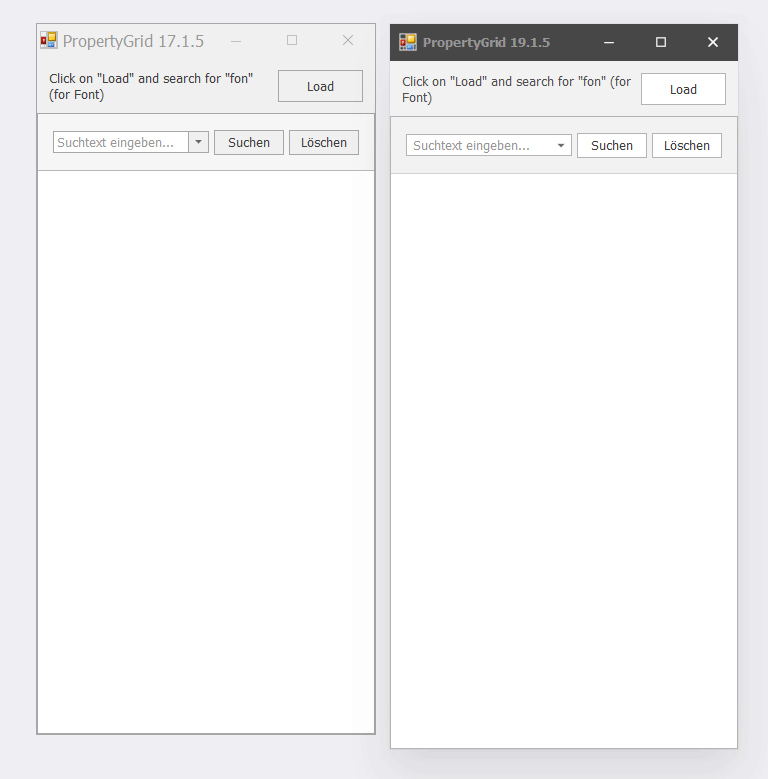

# PropertyGridBench

A test repository to bench the DevExpress PropertyGridControl in different versions. This repository was created for the DevExpress support ticket I wrote:
 * [PropertyGridControl: Performance degradation since version 17.1.5](https://www.devexpress.com/Support/Center/Question/Details/T803721/propertygridcontrol-performance-degradation-since-version-17-1-5)

#### Update 19.08.2019:

Updated to DevExpress 19.1.5 which makes the initial load much faster than in every single version since 17.1.5 - nearly as fast as 17.1.5 itself.
Filtering however, is still unusable (cancelled after 40s video).

